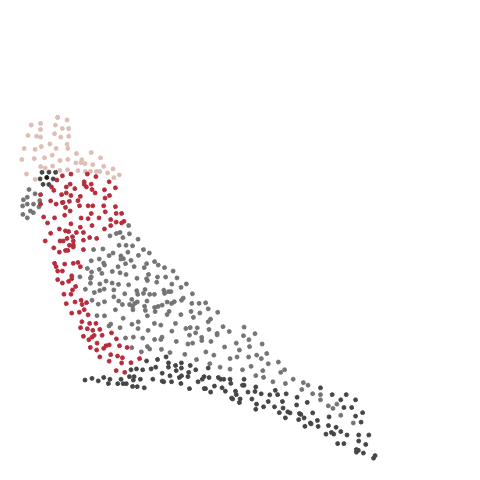

layout: false
class: split-33 with-thick-border border-black

```{css, echo=FALSE}
/* custom.css */
:root{
  --main-color1: #2f4c7a;
  --main-color2: #bcbddc;
  --main-color3: #efedf5;
  --main-color4: #9DDAE5;
  --text-color3: black;
  --text-color4: black;
  --code-inline-color: #4e5054;
  --link-color: #006CAB;
  --logo: url(http://www.fragiletoagile.com.au/wp-content/uploads/2018/02/monash-university-logo-transparent.png);
}
.huge { font-size: 300% }
.large { font-size: 150% }
.largeish { font-size: 120% }
.summarystyle { font-size: 150%;
  line-height:150%;}

.left-code {
  color: #777;
  width: 48%;
  height: 92%;
  float: left;
}
.right-plot {
  width: 50%;
  float: right;
  padding-left: 1%;
}
```


```{r setup, include=FALSE}
options(htmltools.dir.version = FALSE, width = 120)


knitr::opts_chunk$set(echo = TRUE, 
                      warning = FALSE, 
                      message = FALSE,
                      fig.align = "center",
                      fig.height = 6,
                      fig.width = 4,
                      cache.path = "./cache/",
                      fig.path = "./figures/",
                      dev.args = list(bg = "transparent")
                      )
library(knitr)
# preload data
library(tidyverse)
tb <- read_rds(here::here("data", "tb_tidy.rds"))
tb_au <- filter(tb, country == "Australia", !is.na(age_group))


hook_output <- knit_hooks$get("output")
knit_hooks$set(output = function(x, options) {
   lines <- options$output.lines
   if (is.null(lines)) {
     return(hook_output(x, options))  # pass to default hook
   }
   x <- unlist(strsplit(x, "\n"))
   more <- "..."
   if (length(lines)==1) {        # first n lines
     if (length(x) > lines) {
       # truncate the output, but add ....
       x <- c(head(x, lines), more)
     }
   } else {
     x <- c(more, x[lines], more)
   }
   # paste these lines together
   x <- paste(c(x, ""), collapse = "\n")
   hook_output(x, options)
 })

theme_set(
  theme_grey(base_size = 16) +
  theme(
    legend.position = "bottom",
    plot.background = element_rect(fill = "transparent"),
    legend.background = element_rect(fill = "transparent")
  )
)
```


.column[.bottom_abs.content[

]]

.column.bg-main1[.content.vmiddle[.center[


# Data Visualisation with R


### ggplot2 and friends!
<br>
<br>

# Ursula Laa
# and
# Stuart Lee

]]]

---
layout: false
class: split-50 with-thick-border border-white
.column[.content[
# Who are we?

## Ursula Laa
.large[
- Research fellow at Monash University
- Working in particle physics and data visualisation
- Interested in visualisation of high-dimensional data
]

```{r, out.width='50%', out.height='50%', echo=FALSE}

```
]]

.column[.content[

# <br>

## Stuart Lee

.large[
- PhD student at Monash University
- Working in bioinformatics and data visualisation
- Interested in the same things as Ursula!
]

```{r, out.width='50%', out.height='50%', echo=FALSE}

```

]]


---

# Follow along with us

<br>

.large[The material for todays seminar is available online]

<br>


.largeish[
Get the slides from https://sa-lee.github.io/acems_viz_seminar/

Get the source code from https://github.com/sa-lee/acems_viz_seminar
]

<br>

.large[Just open RStudio to go along with the examples!]

```{r, eval = FALSE}
pkgs <- c("tidyverse", "viridis", "maps", "mapproj", "ggthemes", "plotly")
install.packages(pkgs)
```

---

# A grammar of graphics


.large[
The grammar of graphics defines a framework to construct statistical graphics in a principled way, by definind an explicit relationship between the variables in the data you have and the graphic or plot you wish to represent. It was first defined by Lee Wilkinson and extended by Hadley Wickham in the R package `ggplot2`. 
]

--

### `ggplot2` is based on three simple concepts:

.large[
* __Data__: input data should be formated in a data frame, where each column is a variable, and each row is an observation
* __Mapping__: declaring a mapping of input data variables onto aestetics
* __geoms__: the graphical primitives, e.g. geom_line, geom_point
]


--

### Here we uncover how the charts you know by name can be created via `ggplot2`, learn how to construct a `ggplot2` graphic and then build a plot up, layer-by-layer.


---

# Why use the grammar of graphics?

<br>

.large[
The grammar of graphics

- allows us to __define__ the mapping between variables in the data, with elements of the plot
- allows us to see and understand __how__ plots are similar or different
- helps us see how variations in the definition create variations in the plot
]

<br>

### Using named plots, for example a pie chart, bar chart, scatterplot, in some ways is like seeing animals in the zoo.


---

# Example data

### World Health Organisation (WHO) tuberculosis case notifications data 

<br>

.large[To showcase `ggplot2` we will build graphics using a data set provided by the [World Health Organisation (WHO)](https://www.who.int/). This is current tuberculosis (TB) case notifications aggregated by __country__, __gender__ and __age__ group. We have tidied up this data for you and saved it in the R data storage format.]


.largeish[
The data consists of six columns:

* __country:__ the country where the TB case(s) occured
* __iso3:__ a three letter standardised country code
* __year:__ the year when the TB case(s) occured
* __gender:__ whether the TB case(s) belonged to males or females.
* __age_group:__ whether the TB case(s) belonged to someone aged between 15 to 24, 25 to 34,
35 to 44, 45 to 54, 55 to 64 or 65 and above
* __count:__ the total number of TB cases for a given country, year, gender and age group.
]
---


# Load the data in RStudio on your computer

.largeish[On your computer, open RStudio and then load the TB data in with R using the tidyverse:]

```{r tb-01, eval = TRUE, echo = TRUE}
library(tidyverse)
tb <- read_rds("data/tb_tidy.rds")
tb_au <- filter(tb, country == "Australia", !is.na(age_group))
tb_au
```


---

# A first look

.largeish[Let's create charts from the TB data to find out if there are differences between age groups, and gender between TB cases in Australia.

We start with a 100% chart, that compares the proportion of TB cases in each age group by gender.]

<br>

```{r echo=FALSE, fig.width=12, fig.height=5}
ggplot(tb_au, aes(x = year, y = count, fill = gender)) +
  geom_bar(stat = "identity", position = "fill") +
  facet_grid(~ age_group) +
  scale_fill_brewer(palette="Dark2") 
```

---

# A first look

.largeish[Let's create charts from the TB data to find out if there are differences between age groups, and gender between TB cases in Australia.

We start with a 100% chart, that compares the proportion of TB cases in each age group by gender.]

<br>

## What can you learn from a 100% chart? 

.largeish[
There are three key lessons from this chart:

 * The focus is on **proportion** in each category. 
 * Across (almost) all ages, and years, the proportion of males having TB is higher than females
 * These proportions tend to be higher in the older age groups, for all years.
]

---

class: middle center bg-main1

# Building your own ggplot

---

layout: false
class: split-33

.column[.content[
## Stepwise building of a `ggplot2`


We start by passing our *data set* to the ggplot function


```{r plot1, eval=FALSE, echo=TRUE}
ggplot(tb_au) #<<
```

]]

.column[.content.vmiddle[
```{r output1, ref.label="plot1", echo=FALSE, cache=TRUE, fig.height = 5, fig.width=10}
```
]]

---

layout: false
class: split-33

.column[.content[
## Stepwise building of a `ggplot2`


We next define the *aesthetic mapping* (or *variable mapping*)


```{r plot2, eval=FALSE, echo=TRUE}
ggplot(tb_au) +
  aes(x = year, #<<
      y = count, #<<
      fill = gender) #<<
```

]]

.column[.content.vmiddle[
```{r output2, ref.label="plot2", echo=FALSE, cache=TRUE, fig.height = 5, fig.width=10}
```
]]

---

layout: false
class: split-33

.column[.content[
## Stepwise building of a `ggplot2`

Now we specify the geom we want to draw 

```{r plot3, eval=FALSE, echo=TRUE}
ggplot(tb_au) +
  aes(x = year, 
      y = count, 
      fill = gender) +
  geom_bar(stat = "identity", #<<
           position = "fill") #<<
```

.largeish[
- `stat = "identity"` says no need to compute the count (it is already counted in the data)
- `position = "fill"` sets the heights of the bars to be all at 100%, this emphasizes the proportion of males and females
]
]]

.column[.content.vmiddle[
```{r output3, ref.label="plot3", echo=FALSE, cache=TRUE, fig.height = 5, fig.width=10}
```
]]

---

layout: false
class: split-33

.column[.content[
## Stepwise building of a `ggplot2`

We can easily change things like the color palette

```{r plot4, eval=FALSE, echo=TRUE}
ggplot(tb_au) +
  aes(x = year, 
      y = count, 
      fill = gender) +
  geom_bar(stat = "identity", 
           position = "fill") +
  scale_fill_brewer(  #<<
    palette = "Dark2")  #<<
  
```

.largeish[
Here we use a palette from [colorbrewer.org](colorbrewer.org) that accommodates colour blindness.
]
]]

.column[.content.vmiddle[
```{r output4, ref.label="plot4", echo=FALSE, cache=TRUE, fig.height = 5, fig.width=10}
```
]]

---

layout: false
class: split-33

.column[.content[
## Stepwise building of a `ggplot2`

Finally we create a bar chart for each age group by facetting

```{r plot5, eval=FALSE, echo=TRUE}
ggplot(tb_au) +
  aes(x = year, 
      y = count, 
      fill = gender) +
  geom_bar(stat = "identity", 
           position = "fill") +
  scale_fill_brewer(  
    palette = "Dark2") +
  facet_grid(. ~ age_group) #<<
  
```

.largeish[
A `facet` creates subplots for each category (or combination of categories) laid out in a grid. The argument is specified as a *formula*, and is of the form left hand side ~ right hand side.
]
]]

.column[.content.vmiddle[
```{r output5, ref.label="plot5", echo=FALSE, cache=TRUE, fig.height = 5, fig.width=10}
```
]]

---

# Final plot

We created a `ggplot` one layer at a time. Once you become more confident you will be able to start building everything up at once.

```{r echo=TRUE, fig.width=12, fig.height=4.5}
ggplot(tb_au, aes(x = year, y = count, fill = gender)) +
  geom_bar(stat = "identity", position = "fill") +
  facet_grid(~ age_group) +
  scale_fill_brewer(palette="Dark2")
```

---

# Changing things up

.largeish[
We can easily change how the plot is defined and compare different ways of showing the same data.
You can make a bar chart using `ggplot2` by changing the position argument in `geom_bar()` to `stack`: 
]

```{r echo=TRUE, fig.width=12, fig.height=4.5}
ggplot(tb_au, aes(x = year, y = count, fill = gender)) +
  geom_bar(stat = "identity", position = "stack") +
  facet_grid(~ age_group) +
  scale_fill_brewer(palette="Dark2")
```

---
# Changing things up

.largeish[
We can easily change how the plot is defined and compare different ways of showing the same data.
You can make a bar chart using `ggplot2` by changing the position argument in `geom_bar()` to `stack`: 
]

```{r echo=TRUE, eval=FALSE}
ggplot(tb_au, aes(x = year, y = count, fill = gender)) +
  geom_bar(stat = "identity", position = "stack") +
  facet_grid(~ age_group) +
  scale_fill_brewer(palette="Dark2")
```

## What we learn from this chart? 

.largeish[

Plotting the data in a different way changes what we learn from it

- Focus in now on **counts**, showing that counts are different across __ages__, and __years__: counts tend to be lower in middle age (45-64). 
- Shows that in the year 1999, there was a bit of a TB outbreak in most age groups, with numbers doubling or tripling compared to other years.
- The TB Incidence has been increasing among younger age groups in recent years.
]


---

# From 'stacked' to 'side-by-side'

.largeish[Let's change the position argument in `geom_bar()` to `dodge` to show the counts in each age category but with respect to __gender__]

```{r echo=TRUE, fig.width=12, fig.height=4.5}
ggplot(tb_au, aes(x = year, y = count, fill = gender)) +
  geom_bar(stat = "identity", position="dodge") +
  facet_grid(~ age_group) +
  scale_fill_brewer(palette="Dark2")
```

---

# From 'stacked' to 'side-by-side'

.largeish[Let's change the position argument in `geom_bar()` to `dodge` to show the counts in each age category but with respect to __gender__]

```{r echo=TRUE, eval=FALSE}
ggplot(tb_au, aes(x = year, y = count, fill = gender)) +
  geom_bar(stat = "identity", position="dodge") +
  facet_grid(~ age_group) +
  scale_fill_brewer(palette="Dark2")
```

# What can you learn from this chart? 

.largeish[
- Focus on counts by gender, showing predominantly male incidence of TB.
- You can also see that incidence among males relative to females is from middle age onwards. There appears to be
similar incidence between males and females in younger age groups.
]

.largeish[What's changed from your previous charts? The colours, aesthetics and facets have remained the same, it's just the __position__ of the bars that have been altered ]

---
# Changing coordinates

.largeish[
By changing to __polar__ coordinates, things will be layed out in __circles__, rather than __rectangles__, one axis is mapped to an __angle__.
]

```{r plotPolar, eval=TRUE, echo=TRUE, fig.width=12, fig.height=4.5}
ggplot(tb_au, aes(x = year, y = count, fill = gender)) +
  geom_bar(stat = "identity") +
  facet_grid(gender ~ age_group) +
  scale_fill_brewer(palette="Dark2") + 
  coord_polar() 
```

---

# Changing coordinates

.largeish[
By changing to __polar__ coordinates, things will be layed out in __circles__, rather than __rectangles__, one axis is mapped to an __angle__.
]

```{r plotPolarC, eval=FALSE, echo=TRUE}
ggplot(tb_au, aes(x = year, y = count, fill = gender)) +
  geom_bar(stat = "identity") +
  facet_grid(gender ~ age_group) +
  scale_fill_brewer(palette="Dark2") + 
  coord_polar() 
```


# What can you learn from this chart? 

.large[This layout makes it easier to interpret how the chart emphasises the middle age groups as having low incidence accross the years.]


---

# Making a pie chart

.largeish[You can continue to use polar coordinates to make a pie chart.]


```{r plotPie, eval=TRUE, echo=TRUE, fig.width=12, fig.height=4.5}
ggplot(tb_au, aes(x = 1, y = count, fill = factor(year))) +
  geom_bar(stat = "identity", position="fill") +
  facet_grid(gender ~ age_group) +
  coord_polar(theta = "y")
```

---

# Making a pie chart

.largeish[You can continue to use polar coordinates to make a pie chart.]


```{r plotPie2, eval=FALSE, echo=TRUE}
ggplot(tb_au, aes(x = 1, y = count, fill = factor(year))) +
  geom_bar(stat = "identity", position="fill") +
  facet_grid(gender ~ age_group) +
  coord_polar(theta = "y")
```

# What can you learn from this chart? 

.large[The pie chart is pretty but difficult to interpret and not usefull for making comparisons across age.]

---

class: bg-main1 center middle

# (Basic) Perception of visualisations

---

# Re-arrangement and proximity

.large[
Compare the two displays below - how are they different and what information does each of them emphasise?
]

<br>

```{r both, echo=FALSE, fig.height=5, fig.width=14}
a <- tb_au %>% filter(year == 2012) %>%
  ggplot() +
  aes(x=gender, y=count, fill=gender) +
  geom_bar(stat="identity", position="dodge") + 
  facet_wrap(~age_group, ncol=6) +
  scale_fill_brewer("", palette="Dark2") +
  ggtitle("Arrangement A")
b <- tb_au %>% filter(year == 2012) %>%
  ggplot() +
  aes(x=age_group, y=count, fill=age_group) +
  geom_bar(stat="identity", position="dodge") + 
  facet_wrap(~gender, ncol=6) +
  scale_fill_brewer("", palette="Dark2") +
  ggtitle("Arrangement B")
library(gridExtra)
grid.arrange(a, b, nrow=1)
```
---
layout: false
class: split-50 with-thick-border border-white


.column[.content[
# Re-arrangement and proximity

```{r, echo = FALSE, fig.height=5, fig.width=7}
a
```
]]
.column[.content.vmiddle[

.large[
Arrangement A:

- easy to directly compare male and female counts, separately for each age group
- male counts are higher than female counts
- there is a big difference between counts in the 45-54 age group, and over 65 counts are almost the same
]]]

---


layout: false
class: split-50 with-thick-border border-white

.column[.content[
# Re-arrangement and proximity
```{r, echo = FALSE, fig.height=5, fig.width=7}
b
```
]]
.column[.content.vmiddle[
.large[
Arrangement B:

- easy to directly compare counts by age group, separately for females and males
- for females, incidence drops in the middle years
- for males, it is pretty consistently high across age groups
]]]

---
layout: false
class: split-50 with-thick-border border-white

.column[.content[

## Code for re-arrangement

```{r arrA, echo=TRUE, fig.height=5, fig.width=7}
tb_au %>% filter(year == 2012) %>%
  ggplot() +
  aes(x=gender, y=count, fill=gender) +
  geom_bar(stat="identity", position="dodge") + 
  facet_wrap(~age_group, ncol=6) +
  scale_fill_brewer("", palette="Dark2") +
  ggtitle("Arrangement A")
```
]]

.column[.content[

<br>
<br>

```{r arrB, echo=TRUE, fig.height=5, fig.width=7}
tb_au %>% filter(year == 2012) %>%
  ggplot() +
  aes(x=age_group, y=count, fill=age_group) +
  geom_bar(stat="identity", position="dodge") + 
  facet_wrap(~gender, ncol=6) +
  scale_fill_brewer("", palette="Dark2") +
  ggtitle("Arrangement B")
```
]]


---
class: center middle

# Takehome! 

.large[Place graphical elements you want the viewer to compare close to each other!]


---


# Grammar and Statistics
.large[
What we love about ggplot2...
]

.center[

[Source: https://www.wired.com/wp-content/uploads/2016/01/DB-Transformation-Colour.gif](https://www.wired.com/wp-content/uploads/2016/01/DB-Transformation-Colour.gif)
]

<br>

--
.large[
...you can make so many different displays of the same data, and each time something new may emerge.
]

---

class: middle center bg-main1

# Extensions of ggplot2

---
# Drawing maps

.largeish[We can use ggplot2 to create chloropleth maps.

Get data containing lat/long with geographical regions
]

```{r}
world_data <- map_data("world")
head(world_data)
```


---
# Choloropleth map - setting up data

.largeish[We can use ggplot2 to create chloropleth maps.

Compute some summary over a geographical region. Here we compute relative
difference in TB incidence from year to year for each country.
]


```{r reldata, echo = FALSE}
tb_rel <- tb %>% 
  group_by(country, year) %>% 
  summarise(count = sum(count, na.rm = TRUE)) %>% 
  mutate(
    diff = lag(count, 1), 
    reldiff = if_else(diff == 0, 0, (count - diff) / diff)
  ) %>% 
  filter(year != first(year)) %>% 
  ungroup() %>% 
  mutate(
    country=recode(country, 
                   "United States of America"="USA", 
                   "United Kingdom of Great Britain and Northern Ireland"="UK",
                   "Russian Federation"="Russia")
  )

head(tb_rel)
```

---
# Choloropleth map 

.largeish[We can use ggplot2 to create chloropleth maps.
 
Join the geographical regions to the summary data.
]

```{r, echo = FALSE, eval = TRUE}
tb_map <- left_join(
  world_data, 
  tb_rel, 
  by = c("region" = "country")
)
head(tb_map)
```

---
# Chloropleth map

.largeish[Let's look at relative difference from 2012 - 2011]

```{r chloromap, echo = TRUE, eval = FALSE}
library(ggthemes)
map_2012 <- tb_map %>% 
  filter(year == 2012) 
map <- map_2012 %>% 
  ggplot(aes(x = long, y = lat, group = group, fill = reldiff)) + 
  geom_polygon() +
  coord_map(xlim = c(-180, 180)) +
  theme_map() 
map
```

---

# Chloropleth map

```{r chloro-out, ref.label="chloromap", echo=FALSE, cache=TRUE, fig.width=12, fig.height=6}
```


---

# Changing colour palettes

```{r vc, echo = TRUE, eval = FALSE}
library(viridis)
map <- map + scale_fill_viridis(option = "magma")
map
```

---

# Changing colour palettes

```{r viridis-out, ref.label="vc", echo=FALSE, cache=TRUE, fig.height=6, fig.width=12}
```


---

# Facetting

```{r facetMaps, echo = TRUE, eval =  FALSE}
library(ggthemes)
tb_map %>% 
  filter(year %in% 2007:2012) %>% 
  ggplot(aes(x = long, y = lat, group = group, fill = reldiff)) + 
  geom_polygon() +
  coord_map(xlim = c(-180, 180)) +
  scale_fill_viridis(limits = c(-1, 4), option = "magma") +
  facet_wrap(~ year) +
  theme_map() 
```

---
# Facetting

```{r facetMaps-out, ref.label="facetMaps", echo = FALSE, cache = TRUE, fig.height=6, fig.width = 12}
```

---

# Animation or facetting in time

```{r animateMaps, echo = TRUE, eval = FALSE}
library(gganimate)
tb_map %>% 
  filter(year %in% 2007:2012) %>% 
  ggplot(aes(x = long, y = lat, group = group, fill = reldiff)) + 
  geom_polygon() +
  coord_map(xlim = c(-180, 180)) +
  scale_fill_viridis(limits = c(-1, 4), option = "magma") +
  theme_map() +
  transition_time(year)
```

---
# Animation or facetting in time

```{r animateMaps-out, ref.label="animateMaps", fig.width = 12, fig.height = 6, echo = FALSE, cache = TRUE}
```

---

# Adding user interactivity

.largeish[Just add `ggplotly()`!]

```{r plotly, echo = TRUE, fig.height=6, fig.width=12}
library(plotly)
ggplotly(map, tooltip = c("fill"))
```

---
layout: false
class: split-50 with-thick-border border-white

.column[.content[

## Related Packages

.largeish[https://www.ggplot2-exts.org/]

.largeish[https://vegawidget.github.io/vegawidget/]

]]

.column[.content[

## Books

.largeish[https://socviz.co/]

.largeish[https://r4ds.had.co.nz/]

]]


---
class: bg-main1 center middle


## Thanks!

### This talk is based on lecture notes by Dianne Cook.

### These slides are made with R markdown using xaringan and the Kunoichi theme.


